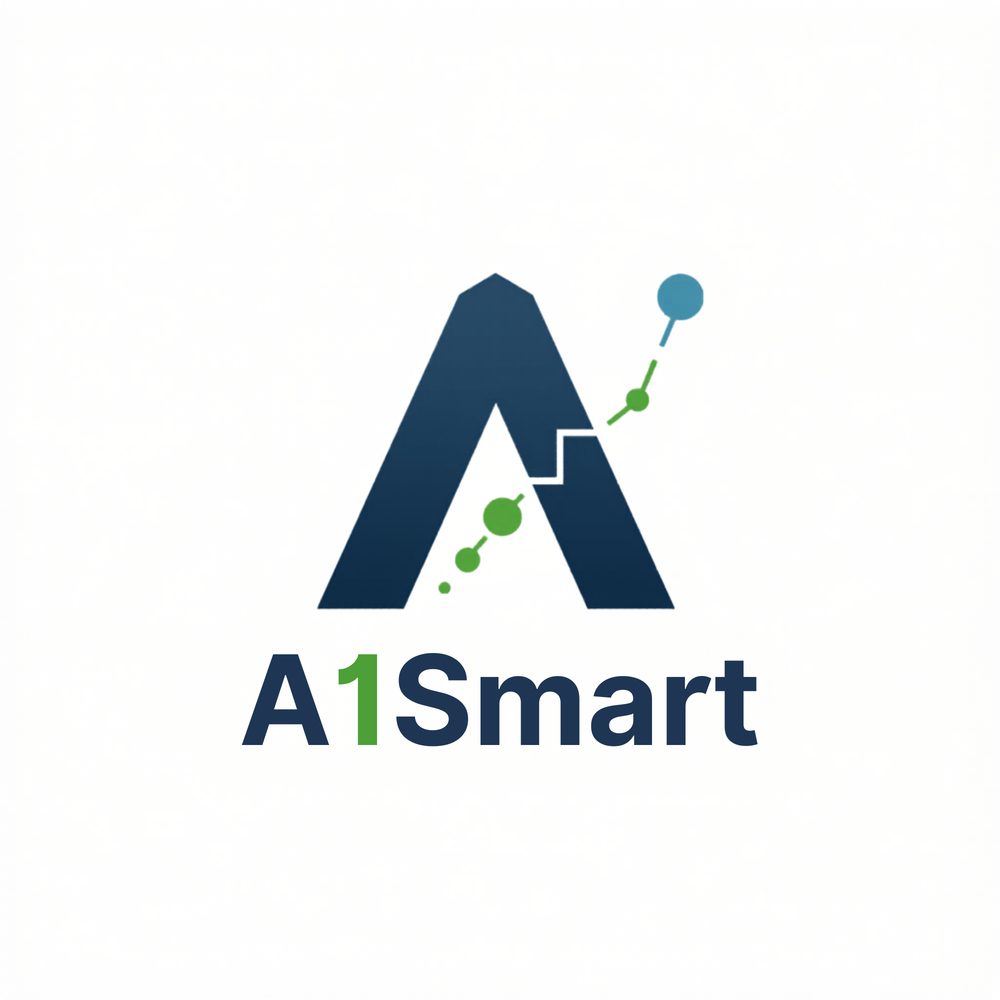

<p align="center">
  
</p>

# A1-SMART v2.0

**에이원스마트부동산중개법인** 부동산 정보 자동화 플랫폼 (Next.js 16 + Supabase 기반 재구축)

- **도메인**: [aonesmart.biz](https://aonesmart.biz) (운영 예정)
- **GitHub**: <https://github.com/junsooLee3814/a1-smart-v2>
- **로컬 작업 폴더**: `C:\Users\juncp\00_claudecode\03_A1_Smart_v2\`
- **PRD**: `C:\Users\juncp\00_claudework\09_a1_smart\docs\PRD_v2.md` — A1-SMART v2.0 재구축 PRD
- **기존 시스템(v1.7)**: 노션 6 DB + Python 11 모듈, `C:\Users\juncp\00_claudework\09_a1_smart\`

---

## 📍 프로젝트 개요

부동산 매물의 공부(등기·토지·건축·토지이용·감정평가) PDF와 이미지를 업로드하면, OCR·LLM·국토부 실거래가 API를 통합해 **합의시세**·**권리분석**·**투자보고서(DOCX/PDF)** 를 자동 생성하는 웹 플랫폼.

### 7단계 워크플로우

| 단계 | 이름 | 책임 |
|---|---|---|
| 1 | 자료수집 선택 | 공부 PDF 1~5개 + 이미지 0~5개 업로드 (수동 / 장래: 자동 발급) |
| 2 | 로그인 | 관리자·회원·게스트 권한 분리 (Supabase Auth) |
| 3 | DB 구축 | Supabase Postgres 6개 테이블 + RLS + Storage 3개 버킷 |
| 4 | 공부 분석·DB 입력 | pdf-parse → Clova OCR → Claude → property_mapper → INSERT |
| 5 | 시세 평가 | 국토부 RTMS + 6개 평가방법 + 권리하자 디스카운트 → 합의시세 |
| 6 | 분석보고서 | docx.js + Puppeteer로 DOCX·PDF 생성, internal/investor 2종 |
| 7 | 프론트엔드 | 홈페이지(공개 매물) + 회원 대시보드 + 관리자 콘솔 |

---

## 🛠 기술 스택

| 계층 | 기술 |
|---|---|
| 프론트엔드 | Next.js 16 (App Router) + TypeScript + React 19 |
| 스타일 | Tailwind CSS v4 + shadcn/ui (예정) |
| 백엔드 | Next.js Route Handlers + Server Actions |
| DB·Auth·Storage | Supabase (Postgres 15 + GoTrue + Storage) |
| LLM | Anthropic Claude Opus 4.7 |
| OCR | Naver Clova OCR |
| 시세 | 국토교통부 RTMS OpenAPI |
| 보고서 | docx.js + Puppeteer (서버리스 PDF) |
| 배포 | Vercel (preview/production) → CNAME → aonesmart.biz |

---

## 🚀 로컬 개발 시작

### 1) 환경 변수 세팅

```bash
cp .env.example .env.local
# .env.local 파일을 열어 실제 값 채우기 (Supabase 키, Anthropic 키 등)
```

### 2) 의존성 설치 (이미 설치된 경우 생략)

```bash
npm install
```

### 3) 개발 서버 실행

```bash
npm run dev
```

→ <http://localhost:3000> 접속

### 4) 타입 검사·린트

```bash
npm run typecheck
npm run lint
```

### 5) 프로덕션 빌드

```bash
npm run build
npm start
```

---

## 📁 폴더 구조 (MVP 시점)

```
a1-smart-v2/
├── branding/                # 로고·사업자등록증 등 브랜드 자산
│   ├── logo_v1.png
│   └── business_registration.pdf
├── public/                  # 정적 자산 (Next.js)
├── src/
│   ├── app/                 # App Router 페이지·레이아웃
│   │   ├── (public)/        # 홈·공개매물·로그인
│   │   ├── (member)/        # 회원 대시보드
│   │   ├── (admin)/         # 관리자 콘솔
│   │   └── api/             # Route Handlers
│   ├── components/          # 재사용 UI 컴포넌트 (shadcn/ui 포함 예정)
│   └── lib/
│       ├── supabase/
│       │   ├── client.ts    # 브라우저 Supabase 클라이언트
│       │   └── server.ts    # 서버 컴포넌트·Route Handler용
│       └── utils.ts         # cn() 등 공용 유틸
├── .env.example
├── .gitignore
├── next.config.ts
├── package.json
├── tsconfig.json
└── README.md
```

---

## 🔐 보안·정책 (v1.7 계승)

- **PII 마스킹**: 주민번호 뒷자리는 OCR 직후 정규식 마스킹 → DB 저장 전 적용
- **덮어쓰기 금지**: 시세 갱신 시 실거래 0건이면 가격 필드 보존
- **외부용 보고서**: PNU·내부 메모·1순위 채권자 실명 자동 제거
- **압류·경매 매물**: 권리하자 디스카운트 0~30% 자동 적용
- **Supabase RLS**: 관리자 외에는 공개 매물(`is_public=true`)만 조회
- **Storage Signed URL**: 공부 PDF는 5분 만료, 관리자만 접근

---

## 📋 마일스톤 (PRD §11)

- [x] **M0** 환경 셋업·리포 초기화·자산 정리
- [ ] **M1** Supabase 스키마·RLS·Auth 구축 (단계 3)
- [ ] **M2** 단계 1·2 (업로드 + 로그인)
- [ ] **M3** 단계 4 (파이프라인 포팅: pdf-parse·OCR·Claude)
- [ ] **M4** 단계 5 (시세 평가 TS 포팅 + 단위 테스트 100건)
- [ ] **M5** 노션 → Supabase 마이그레이션 + 검증
- [ ] **M6** 단계 6 (보고서 DOCX·PDF 서버리스)
- [ ] **M7** 단계 7 (홈페이지·관리자 대시보드·회원)
- [ ] **M8** 통합 QA·보안 점검·도메인 연결

---

## 📞 운영 주체

- **법인**: 에이원스마트부동산중개법인
- **연락처**: sm@sunmyung.kr
- **사업자등록증**: `branding/business_registration.pdf` 참조
